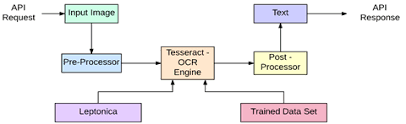

# Image to Text Parsing with Python

## TechStack
- Python 3
- Tesseract Open Source OCR Engine
- PyTesseract
- OpenCV

## Introduction
OCR = Optical Character Recognition. In other words, OCR systems transform a two-dimensional image of text, that could contain machine printed or handwritten text from its image representation into machine-readable text. OCR as a process generally consists of several sub-processes to perform as accurately as possible. The subprocesses are:

- Preprocessing of the Image
- Text Localization
- Character Segmentation
- Character Recognition
- Post Processing

The sub-processes in the list above of course can differ, but these are roughly steps needed to approach automatic character recognition. In OCR software, it’s main aim to identify and capture all the unique words using different languages from written text characters.

## Tesseract Process flow

## Usage

1. Using Python 3 run the OCR.py script 
2. When prompted, enter the location of the file you want to parse
3. Enter as many files as you want, you will be prompted for each one.
4. When done entering files, type 'end' on the final enter file prompt.
5. Doing so will end the input of the files and run the operation asyncronously.  
6. When parsing is completed, you will see the output for each file in the command line after a line of 'OutPut: X' where is x is the nth file you entered as input.